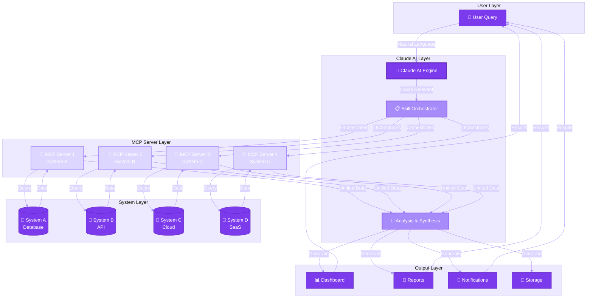
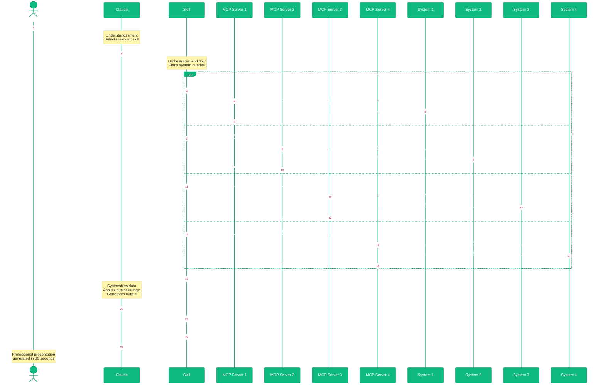
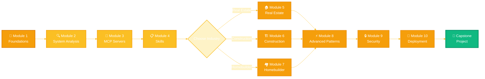

# Claude Enterprise Integrations

<div align="center">


**Build production-ready multi-system integrations with Claude AI and Model Context Protocol**

[🚀 Get Started](#-quick-start) • [📚 Documentation](#-course-structure) • [💼 Examples](#-industry-examples) • [🤝 Contributing](#-contributing)

</div>

---

## 📊 Tech Stack

<div align="center">

### Core Technologies


### Frameworks & Libraries


### Testing & Quality


### Deployment & CI/CD


</div>

---

## 🎯 Overview

This comprehensive course teaches you how to build **production-ready integrations** that connect Claude AI with 4-5 proprietary systems using **Model Context Protocol (MCP)**. Whether you're working in real estate, construction, homebuilding, or any other industry, you'll learn to transform Claude into your organization's unified intelligence layer.

### Why This Course?

- ✅ **Production-Ready Code** - Not just concepts, actual working implementations
- ✅ **Multi-System Architecture** - Integrate 4-5 systems, not just single APIs  
- ✅ **Industry-Specific** - Real estate, construction, homebuilding examples
- ✅ **Complete Workflows** - End-to-end implementations, not code snippets
- ✅ **Best Practices** - Security, testing, deployment, monitoring

---

## 🏗️ System Architecture



---

## 🔄 Integration Workflow



---

## 📁 Repository Structure

```
claude-enterprise-integrations/
│
├── 📄 README.md                          # You are here
├── 📄 LICENSE                            # MIT License
├── 📄 CONTRIBUTING.md                    # Contribution guidelines
├── 📄 CODE_OF_CONDUCT.md                 # Community guidelines
├── 📄 CHANGELOG.md                       # Version history
├── 📄 .gitignore                         # Git ignore rules
│
├── 📁 .github/                           # GitHub configuration
│   ├── workflows/                        # CI/CD pipelines
│   │   ├── test.yml                      # Automated testing
│   │   ├── lint.yml                      # Code quality checks
│   │   └── deploy.yml                    # Deployment automation
│   ├── ISSUE_TEMPLATE/                   # Issue templates
│   └── PULL_REQUEST_TEMPLATE.md          # PR template
│
├── 📁 modules/                           # 🎓 Course modules
│   ├── 01-foundations/                   # ✅ COMPLETE
│   │   ├── README.md                     # Module content
│   │   ├── exercises/                    # Hands-on exercises
│   │   │   ├── exercise-1.md
│   │   │   └── solutions/
│   │   └── assets/                       # Module resources
│   │       └── diagrams/
│   ├── 02-system-analysis/               # 📋 In Progress
│   │   ├── README.md
│   │   ├── templates/
│   │   │   └── system-analysis-worksheet.md
│   │   └── examples/
│   ├── 03-building-mcp-servers/
│   ├── 04-creating-skills/
│   ├── 05-real-estate-example/
│   ├── 06-construction-example/
│   ├── 07-homebuilder-example/
│   ├── 08-advanced-patterns/
│   ├── 09-security-compliance/
│   └── 10-deployment-operations/
│
├── 📁 templates/                         # 🛠️ Reusable templates
│   ├── mcp-servers/                      # MCP server templates
│   │   ├── python/
│   │   │   ├── basic_mcp_server.py       # ✅ Production-ready
│   │   │   ├── oauth_mcp_server.py       # OAuth authentication
│   │   │   └── jwt_mcp_server.py         # JWT authentication
│   │   └── nodejs/
│   │       ├── basic_mcp_server.js
│   │       └── typescript_mcp_server.ts
│   ├── skills/                           # Skill templates
│   │   ├── SKILL_TEMPLATE.md             # ✅ Official structure
│   │   ├── simple-skill/                 # Basic skill example
│   │   └── advanced-skill/               # Complex skill example
│   └── deployment/                       # Deployment configs
│       ├── Dockerfile
│       ├── docker-compose.yml
│       ├── kubernetes/
│       │   ├── deployment.yaml
│       │   └── service.yaml
│       └── .env.example
│
├── 📁 examples/                          # 💼 Industry examples
│   ├── real-estate/                      # ✅ Architecture complete
│   │   ├── README.md                     # Implementation guide
│   │   ├── mcp_servers/                  # 4 MCP servers
│   │   │   ├── mls_server.py
│   │   │   ├── crm_server.py
│   │   │   ├── analytics_server.py
│   │   │   └── document_server.py
│   │   ├── skill/                        # Complete skill
│   │   │   ├── SKILL.md
│   │   │   ├── references/
│   │   │   ├── scripts/
│   │   │   └── assets/
│   │   ├── data/                         # Sample data
│   │   │   ├── sample_mls_data.json
│   │   │   └── sample_crm_data.json
│   │   ├── tests/                        # Test suite
│   │   └── demo.py                       # Working demo
│   ├── construction/                     # 📋 Planned
│   │   └── README.md
│   ├── homebuilder/                      # 📋 Planned
│   │   └── README.md
│   └── healthcare/                       # 💡 Bonus example
│       └── README.md
│
├── 📁 resources/                         # 📚 Additional resources
│   ├── best-practices.md                 # Design patterns
│   ├── architecture-patterns.md          # Common architectures
│   ├── security-checklist.md             # Security guidelines
│   ├── api-design-guide.md               # API design principles
│   ├── troubleshooting.md                # Common issues & solutions
│   ├── glossary.md                       # Terms & definitions
│   └── faq.md                            # Frequently asked questions
│
├── 📁 exercises/                         # 🏋️ Hands-on practice
│   ├── exercise-01-system-analysis/
│   │   ├── README.md
│   │   └── solution/
│   ├── exercise-02-first-mcp-server/
│   ├── exercise-03-skill-creation/
│   └── capstone-projects/
│       ├── project-1-basic-integration.md
│       ├── project-2-advanced-integration.md
│       └── project-3-production-deployment.md
│
├── 📁 tests/                             # 🧪 Testing framework
│   ├── __init__.py
│   ├── conftest.py                       # Pytest configuration
│   ├── test_mcp_servers.py               # MCP server tests
│   ├── test_skills.py                    # Skill tests
│   ├── test_integration.py               # Integration tests
│   └── fixtures/                         # Test data
│       └── sample_data.json
│
├── 📁 scripts/                           # ⚙️ Utility scripts
│   ├── init_skill.py                     # Initialize new skill
│   ├── package_skill.py                  # Package skill for distribution
│   ├── validate_mcp.py                   # Validate MCP server
│   ├── setup_dev_env.sh                  # Development environment setup
│   └── run_tests.sh                      # Run all tests
│
├── 📁 docs/                              # 📖 Documentation
│   ├── api-reference/                    # API documentation
│   │   ├── mcp-server-api.md
│   │   └── skill-api.md
│   ├── deployment-guide/                 # Deployment docs
│   │   ├── docker.md
│   │   ├── kubernetes.md
│   │   └── cloud-providers.md
│   ├── tutorials/                        # Step-by-step guides
│   │   ├── your-first-integration.md
│   │   └── advanced-patterns.md
│   └── contributing/                     # Contribution docs
│       ├── code-style.md
│       └── review-process.md
│
└── 📁 tools/                             # 🔧 Development tools
    ├── linters/                          # Code quality tools
    │   ├── .pylintrc
    │   └── .eslintrc.js
    └── formatters/                       # Code formatters
        ├── .prettierrc
        └── pyproject.toml
```

---

## 🚀 Quick Start

### Prerequisites

- **Python** 3.9 or higher
- **Node.js** 18 or higher  
- **Git** for version control
- **Docker** (optional, for containerized deployments)
- **Claude API access** from Anthropic

### Installation

```bash
# 1. Clone the repository
git clone https://github.com/yourusername/claude-enterprise-integrations.git
cd claude-enterprise-integrations

# 2. Set up Python environment
python -m venv venv
source venv/bin/activate  # On Windows: venv\Scripts\activate
pip install -r requirements.txt

# 3. Set up Node.js dependencies (for some MCP servers)
npm install

# 4. Configure environment variables
cp templates/deployment/.env.example .env
# Edit .env with your API keys

# 5. Run tests to verify setup
pytest tests/
npm test

# 6. Start with Module 1
cd modules/01-foundations
cat README.md
```

### Run Your First Demo

```bash
# Run the healthcare integration demo
cd examples/healthcare
python demo.py

# Run the real estate integration demo (when complete)
cd examples/real-estate
python demo.py
```

---

## 📚 Course Structure

<table>
<tr>
<th>Module</th>
<th>Topic</th>
<th>Duration</th>
<th>Status</th>
<th>Difficulty</th>
</tr>
<tr>
<td>1️⃣</td>
<td><a href="modules/01-foundations">Foundations</a></td>
<td>2 hours</td>
<td>✅ Complete</td>
<td>🟢 Beginner</td>
</tr>
<tr>
<td>2️⃣</td>
<td><a href="modules/02-system-analysis">System Analysis</a></td>
<td>3 hours</td>
<td>🚧 In Progress</td>
<td>🟢 Beginner</td>
</tr>
<tr>
<td>3️⃣</td>
<td><a href="modules/03-building-mcp-servers">Building MCP Servers</a></td>
<td>4 hours</td>
<td>📋 Planned</td>
<td>🟡 Intermediate</td>
</tr>
<tr>
<td>4️⃣</td>
<td><a href="modules/04-creating-skills">Creating Skills</a></td>
<td>3 hours</td>
<td>📋 Planned</td>
<td>🟡 Intermediate</td>
</tr>
<tr>
<td>5️⃣</td>
<td><a href="modules/05-real-estate-example">Real Estate Example</a></td>
<td>3 hours</td>
<td>📋 Planned</td>
<td>🟡 Intermediate</td>
</tr>
<tr>
<td>6️⃣</td>
<td><a href="modules/06-construction-example">Construction Example</a></td>
<td>3 hours</td>
<td>📋 Planned</td>
<td>🟡 Intermediate</td>
</tr>
<tr>
<td>7️⃣</td>
<td><a href="modules/07-homebuilder-example">Homebuilder Example</a></td>
<td>3 hours</td>
<td>📋 Planned</td>
<td>🟡 Intermediate</td>
</tr>
<tr>
<td>8️⃣</td>
<td><a href="modules/08-advanced-patterns">Advanced Patterns</a></td>
<td>4 hours</td>
<td>📋 Planned</td>
<td>🔴 Advanced</td>
</tr>
<tr>
<td>9️⃣</td>
<td><a href="modules/09-security-compliance">Security & Compliance</a></td>
<td>3 hours</td>
<td>📋 Planned</td>
<td>🔴 Advanced</td>
</tr>
<tr>
<td>🔟</td>
<td><a href="modules/10-deployment-operations">Deployment & Operations</a></td>
<td>4 hours</td>
<td>📋 Planned</td>
<td>🔴 Advanced</td>
</tr>
<tr>
<td colspan="2"><strong>Total Course Time</strong></td>
<td colspan="3"><strong>32 hours</strong></td>
</tr>
</table>

---

## 💼 Industry Examples

### Real Estate Integration
**Systems:** MLS • CRM • Analytics • Documents  
**Use Cases:** Buyer presentations, market analysis, property matching  
**Status:** 🚧 Architecture complete, implementation in progress

[View Example →](examples/real-estate)

### Construction Integration
**Systems:** Project Management • Supply Chain • Equipment • Subcontractors  
**Use Cases:** Bid analysis, resource allocation, progress tracking  
**Status:** 📋 Planned

[View Example →](examples/construction)

### Homebuilder Integration
**Systems:** BIM/Design • Sales CRM • Construction Mgmt • Warranty  
**Use Cases:** Design-to-build pipeline, selection management, scheduling  
**Status:** 📋 Planned

[View Example →](examples/homebuilder)

### Healthcare Integration (Bonus)
**Systems:** EHR • Lab • Billing • Scheduling  
**Use Cases:** Patient views, risk analysis, revenue optimization  
**Status:** ✅ Complete working demo available

[View Example →](examples/healthcare)

---

## 🎓 Learning Path



---

## 🛠️ Templates & Tools

### MCP Server Templates

| Template | Authentication | Use Case | Language |
|----------|---------------|----------|----------|
| **Basic MCP Server** | API Key | Simple REST APIs | Python |
| **OAuth MCP Server** | OAuth 2.0 | Enterprise SaaS | Python |
| **JWT MCP Server** | JWT Tokens | Microservices | Python |
| **Node.js MCP Server** | API Key | JavaScript APIs | Node.js |
| **TypeScript MCP Server** | OAuth 2.0 | Type-safe APIs | TypeScript |

[View All Templates →](templates/)

### Skill Templates

- **Simple Skill** - Basic single-system skill
- **Multi-System Skill** - Orchestrates 4+ systems
- **Advanced Skill** - With caching, webhooks, batch processing

[View All Templates →](templates/skills/)

---

## 🔒 Security & Compliance

- ✅ **Authentication** - API keys, OAuth 2.0, JWT support
- ✅ **Encryption** - TLS/SSL for data in transit
- ✅ **RBAC** - Role-based access control patterns
- ✅ **Audit Logging** - Complete activity tracking
- ✅ **Compliance** - HIPAA, SOC 2, GDPR guidelines

[Security Checklist →](resources/security-checklist.md)

---

## 🧪 Testing

```bash
# Run all tests
pytest

# Run specific test suite
pytest tests/test_mcp_servers.py

# Run with coverage
pytest --cov=./ --cov-report=html

# Run integration tests
pytest tests/test_integration.py -v

# Run linting
black . --check
flake8 .
eslint .
```

---

## 🤝 Contributing

We love contributions! Whether you're:

- 🐛 Reporting bugs
- 💡 Suggesting features
- 📝 Improving documentation
- 🔧 Submitting code
- 🎨 Adding industry examples

Please read our [Contributing Guide](CONTRIBUTING.md) and [Code of Conduct](CODE_OF_CONDUCT.md).

### Quick Contribution Steps

1. Fork the repository
2. Create a feature branch (`git checkout -b feature/amazing-feature`)
3. Commit your changes (`git commit -m 'Add amazing feature'`)
4. Push to the branch (`git push origin feature/amazing-feature`)
5. Open a Pull Request

---

## 📖 Documentation

- **[API Reference](docs/api-reference/)** - Complete API documentation
- **[Deployment Guide](docs/deployment-guide/)** - Deploy to production
- **[Tutorials](docs/tutorials/)** - Step-by-step guides
- **[FAQ](resources/faq.md)** - Frequently asked questions
- **[Troubleshooting](resources/troubleshooting.md)** - Common issues & solutions

---

## 🌟 Showcase

Built something awesome with this course? We'd love to feature it!

[Submit your project →](https://github.com/yourusername/claude-enterprise-integrations/discussions/categories/show-and-tell)

---

## 📊 Project Stats


---

## 📞 Support

- 💬 **[GitHub Discussions](https://github.com/yourusername/claude-enterprise-integrations/discussions)** - Ask questions, share ideas
- 🐛 **[Issue Tracker](https://github.com/yourusername/claude-enterprise-integrations/issues)** - Report bugs
- 📧 **Email** - contact@yoursite.com
- 💼 **[LinkedIn](https://linkedin.com/in/yourprofile)** - Professional network
- 🐦 **[Twitter](https://twitter.com/yourhandle)** - Updates & announcements

---

## 📜 License

This project is licensed under the **MIT License** - see the [LICENSE](LICENSE) file for details.

---

## 🙏 Acknowledgments

- **Anthropic** - For Claude AI and MCP framework
- **Contributors** - Everyone who has contributed to this project
- **Community** - For feedback, suggestions, and support

---

## 🚀 Roadmap

### Q1 2025
- ✅ Complete Module 1: Foundations
- 🚧 Complete Module 2: System Analysis
- 📋 Real Estate example implementation
- 📋 Testing framework

### Q2 2025
- 📋 Modules 3-4 complete
- 📋 Construction & Homebuilder examples
- 📋 Advanced patterns module
- 📋 Video tutorials

### Q3 2025
- 📋 Security & Deployment modules
- 📋 Additional industry examples
- 📋 Certification program
- 📋 Enterprise licensing

### Q4 2025
- 📋 Advanced topics
- 📋 GraphQL integration patterns
- 📋 Multi-tenant architectures
- 📋 Community showcase platform

---

<div align="center">

**[⬆ Back to Top](#claude-enterprise-integrations)**

Made with ❤️ for developers building the future of AI integration

**[Get Started Now](#-quick-start)** • **[View Examples](#-industry-examples)** • **[Join Community](https://github.com/yourusername/claude-enterprise-integrations/discussions)**

---


</div>
